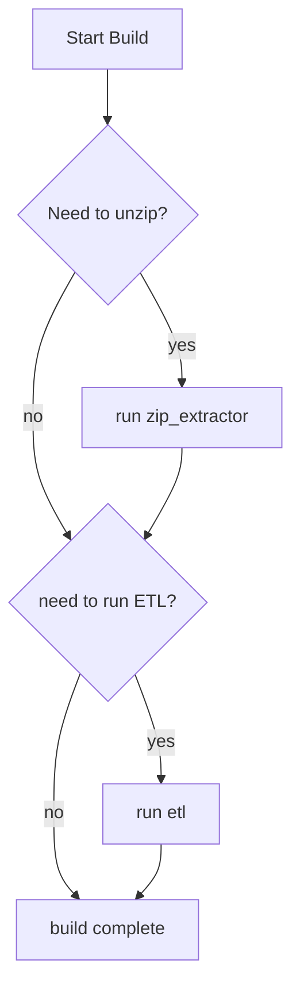

# Data Pipeline Directory Overview

The `data_pipeline/` folder contains the `zip_extractor/` and `etl/` packages. These packages are responsible for decompressing zip files and cleaning / formatting the files for use by the main application. After the initial setup, the pipeline significantly reduces runtime on subsequent simulation runs by removing the file I/O bottleneck.

For details on the data files, see the [data folder documentation](../data/DATA.md)

## How to Run

The `data_pipeline/` is designed to automatically run on build of the main application. The `zip_extractor/` package runs first, followed by the `etl/` package. If the desired outputs of either package already exist, execution of that package is skipped.

For more details on how to run the application, see the project's [README](../README.md)

### Diagram

## Packages

### `zip_extractor/`

A Rust-based utility that scans the `data/zips/` directory, extracts ZIP archives, and outputs the decompressed files into the `data/raw/` folder. It handles both single-file archives and multi-file folders.

### `etl/`

A C++ application that performs extraction, transformations, and loading (ETL) of the raw data files within `data/raw/`. It writes the processed, standardized outputs to the `data/clean/` folder, which is directly used by the main application.

#### Classes
- `SystemConfig` : defines system-specific parameters and lambdas, used to instantiate singleton configurations for Subway, MetroNorth, and Long Island Railroad.

#### Methods
- `process_stations(const SystemConfig &config)` : reads rail system station data and outputs a cleaned version with fewer columns.

- `process_routes(const SystemConfig &config)` : reads rail system trip and stop time data, aggregates stop-by-stop routes per train line and headsign, and outputs a cleaned version with significantly reduced data size from roughly 550,000 to about 50 lines per rail system.
